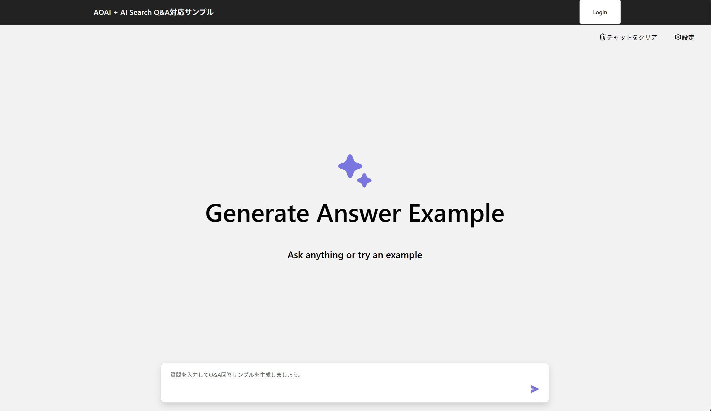

# Chat App to Generate Sample Answers Based on User's Question and Past Q&A History

## Overview
This project is a chat application that generates sample answers based on the user's question and past Q&A history. It leverages the OpenAI API to generate responses and provides a simple web interface for users to interact with. Additionally, it utilizes hybrid search capabilities powered by Azure Cognitive Search to combine AI-driven semantic search with traditional keyword-based search, ensuring more accurate and relevant results.

This application is based on the following repository: [Azure Search OpenAI Demo](https://github.com/Azure-Samples/azure-search-openai-demo/tree/main).

## How to use
Run the following command to provide Azure resources for the application. The provisioned resources will have the necessary environment variables set and role assignments configured for managed identity authentication:
```bash
cd infra
chmod +x scripts/main.sh
./scripts/main.sh
```

Copy and rename the file `apps/backend/.env-sample` to `.env`.
```bash
cp apps/backend/.env-sample apps/backend/.env
```

Then fill in the required environment variables in the `.env` file:
- AZURE_OPENAI_ENDPOINT_URL
- AZURE_OPENAI_API_KEY *(Not required in most cases, as managed identity authentication should be enabled after running the setup script. Only use the API key as a workaround if there are issues with managed identity authentication.)*
- AZURE_AI_SEARCH_ENDPOINT
- AZURE_AI_SEARCH_API_KEY *(Not required in most cases, as managed identity authentication should be enabled after running the setup script. Only use the API key as a workaround if there are issues with managed identity authentication.)*

Before setting the following environment variables, make sure to register your application and create a client secret in Microsoft Entra. You can use the same value for both `AZURE_SERVER_APP_ID` and `AZURE_CLIENT_APP_ID`.
- AZURE_SERVER_APP_ID="your_server_app_id"
- AZURE_SERVER_APP_SECRET="your_server_app_secret"
- AZURE_CLIENT_APP_ID="your_client_app_id"
- AZURE_TENANT_ID="your_tenant_id"

<!-- アプリケーション登録、リダイレクトURIの設定、APIの公開については別紙参照 -->

Run the following command to start the application on your local machine:
```bash
cd ../backend
# Create a virtual environment
python3 -m venv .venv
source .venv/bin/activate
# Install the required packages for the backend
pip install -r requirements.txt
# Start the backend application
quart run

# Install the required modules for the frontend
cd apps/frontend
npm install
# Start the frontend application
npm run dev
```

Open your web browser and navigate to `http://localhost:5173` to access the chat application.


Run the following command to deploy the application:
```bash
# Build the frontend pplication
cd apps/frontend
npm run build

# Zip the backend application
cd ../backend
zip -r app.zip . \
  -x "venv/*" \
  -x "venv/**" \
  -x "*.pyc" \
  -x "__pycache__/*" \
  -x ".env" \
  -x "app.zip"
az webapp deploy \
    --name <your-app-name> \
    --resource-group <your-resource-group> \
    --type zip \
    --src-path app.zip
```
